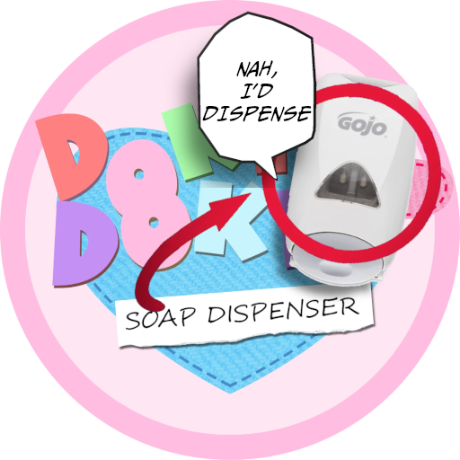

# Doki Doki Soap Dispenser

  

This is just a random shitpost mod I decided to make.
This repo only exists to store my progress on the mod lmao
It is currently unfinished but you can go ahead and download it anyway if you really want to.

## Install

To install, download DDSD.zip from Releases. Extract it, then copy all the files from the DDSD-4.2.3-Py2-Renpy7Mod folder into your DDLC folder. Make sure to click "Yes" when a window pops up asking you to replace files with the same name. To run the game, make sure to run DDSD.exe.
If you don't have DDLC, get the game from [here](https://ddlc.moe).

## Credits

This mod was made with bronya_rand's template. Copyright © 2019-2023 Azariel Del Carmen (bronya_rand). All rights reserved.

Doki Doki Literature Club, the Doki Doki Literature Club code, is the property of Team Salvato (Dan Salvato LLC). Copyright © 2017 Team Salvato. All rights reserved.
